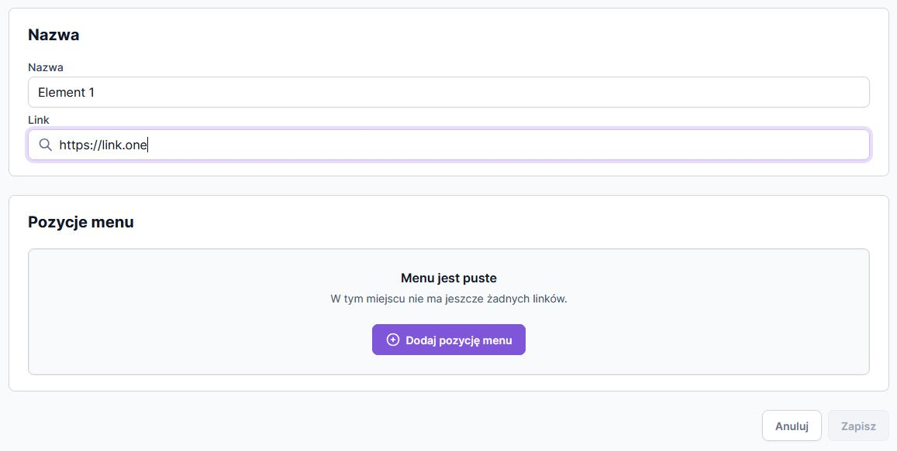

## Installation




<br>

Clone the repository:

```
git clone git@github.com:NumerDev/dnd-recruitment-task.git
```

Install dependencies:

```
npm install
# or
yarn install
#oor
pnpm install
```

Start the development server:

```
npm run dev
# or
yarn dev
# or
pnpm dev
# or
bun dev
```

## Structure

```
src
├── context                    # Context provider
├── lib                        # Tailwind utilities
├── app
│   ├── components
│   │   ├── common            # Common components like button
│   │   ├── Form              # Form related components for adding menut items
│   │   ├── SortableTree      # Sortable tree component
│   │   └── Menu              # Menu related item components
│   ├── context               # Context provider
```
