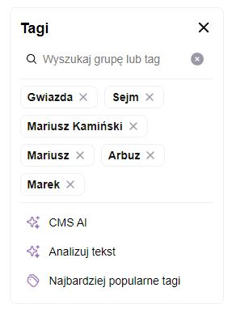

## Tag Select Panel  

### Implemented functionalities

- Searching for tags: Users can enter a search query in the search input to filter the available tags based on their names.
- Selecting tags: Users can select tags from the filtered list of tags. The selected tags are displayed in a separate list.
- Removing tags: Users can remove individual tags from the selected tags list by clicking on the remove button next to each tag.
- Displaying additional actions: The component displays section with additional actions.
- Visibility score: The component calculates and displays a visibility score based on the number of selected tags. It provides visual feedback using colored pills and a rating message

### Props

| Prop                 | Type          | Default  | Description                                                                            |
| -------------------- | ------------- | -------- | -------------------------------------------------------------------------------------- |
| title                | **string**    |          | Title of the panel                                                                     |
| placeholder          | **string**    | "Search" | Placeholder of the search input                                                        |
| searchText           | **string**    | ""       | Current value of the search input                                                      |
| onSearchChange       | **function**  |          | Callback function that is called when the search input value changes                   |
| selectedTags         | **TagType[]** | []       | Array of selected tags                                                                 |
| onSelectedTagsChange | **function**  |          | Callback function that is called when the selected tags change                         |
| onTagRemove          | **function**  |          | Callback function that is called when a tag is removed                                 |
| tagsData             | **TagType[]** | []       | Array of tags data                                                                     |
| tagsRequiredQuantity | **number**    | 5        | Minimum number of selected tags                                                        |
| children             | **ReactNode** |          | React node that will be rendered inside the SelectPanel component as an anchor element |
| isOpen               | **boolean**   | false    | Boolean value that determines whether the SelectPanel is open or not                   |

### Usage

```tsx
import SelectPanel from "./SelectPanel";

const [searchText, setSearchText] = useState("");

// These could be replaced with the actual data from the API
const tagsData = [
  {
    id: 1,
    name: "JavaScript",
    relatedTags: 5,
  },
  {
    id: 2,
    name: "React",
    relatedTags: 6,
  },
  {
    id: 3,
    name: "TypeScript",
    relatedTags: 22,
  },
];

const selectedTags = [
  {
    id: 1,
    name: "JavaScript",
    relatedTags: 64,
  },
  {
    id: 2,
    name: "React",
    relatedTags: 13,
  },
];

const onSearchChange = (value: string) => {
  setSearchText(value);
  console.log("Search value changed:", value);
};

const onSelectedTagsChange = (tags: TagType[]) => {
  console.log("Selected tags changed:", tags);
};

const onTagRemove = (tag: TagType) => {
  console.log("Tag removed:", tag);
};

const onClose = () => {
  console.log("Select panel closed");
};

const requiredQuantity = 5;

<SelectPanel
  title="Tagi"
  placeholder="Wyszukaj grupę lub tag"
  searchText={searchText}
  onSearchChange={setSearchText}
  selectedTags={selectedTags}
  onSelectedTagsChange={onSelectedTagsChange}
  onTagRemove={onTagRemove}
  tagsData={tagsData}
  tagsRequiredQuantity={requiredQuantity}
  onClose={onClose}
/>;
```

### Example



### Libraries and Replacements

- **styled-components**: The component uses styled-components for styling. It can be replaced with other CSS-in-JS libraries like Emotion or traditional CSS stylesheets.
- **Icon**: The component uses custom Icon components for various icons. These icons can be replaced with icons from other icon libraries like Font Awesome or Material-UI icons.
- **SearchList**: The SearchList component is used to display the filtered list of tags when a search query is entered. It can be replaced any multiselect dropdown or components like combobox or autocomplete.
- **TagList**: The TagList component is used to display the list of selected tags. It can be replaced with other tag input libraries like react-tag-input
- **VisibilityScore**: The VisibilityScore component is used to display the visibility score based on the number of selected tags. It can be replaced with other progress or rating components like react-circular-progressbar or react-rating-component

### Potentail improvements

- More tests for the component edge cases
- More customization options for the component
- Support for different languages
- Support for internationalization
- Custom UI for mobile devices
- Better support for keyboard navigation
- Support for screen readers
- Support for accessibility features
- Support for custom styling
